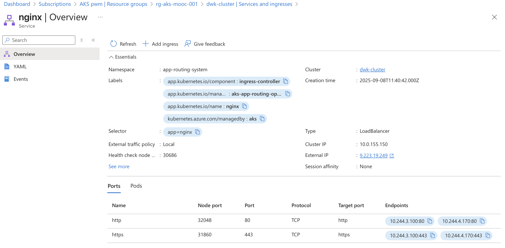

# Chapter 4

# Exercise: 3.2. Back to Ingress AKS

- GKE runs with a built-in ingress controller (Google L7) out of the box.
- AKS does not ship with a default ingress-controller.

## Fastest fix (managed NGINX on AKS)

**Enable the Application Routing add-on (managed NGINX):**
`az aks update -g <RESOURCE_GROUP> -n <CLUSTER_NAME> --enable-app-routing`

then add this to the Ingress Spec:
`ingressClassName: webapprouting.kubernetes.azure.com`

[Managed NGINX ingress with the application routing add-on](https://learn.microsoft.com/en-us/azure/aks/app-routing?utm_source=chatgpt.com)


## Enable Approuting for AKS.

Create Nginx Ingress controller with Application Routing add-on:

```bash
➜ az aks approuting enable --resource-group rg-aks-mooc-001 --name dwk-cluster
```



## Redeploy the application with the updated ingress spec.

```bash
➜ ./script/ping-pong.sh delete
Deleting resources from namespace exercises...
secret "ping-pong-secrets" deleted
configmap "log-output-config" deleted
deployment.apps "ping-pong-deployment" deleted
service "ping-pong-svc" deleted
ingress.networking.k8s.io "ping-pong-ingress" deleted

➜ ./script/ping-pong.sh apply
Applying resources to namespace exercises...
Error from server (AlreadyExists): namespaces "exercises" already exists
secret/ping-pong-secrets created
configmap/log-output-config created
deployment.apps/ping-pong-deployment created
service/ping-pong-svc created
ingress.networking.k8s.io/ping-pong-ingress created

➜ k get svc
NAME            TYPE       CLUSTER-IP    EXTERNAL-IP   PORT(S)        AGE
ping-pong-svc   NodePort   10.0.107.16   <none>        80:32522/TCP   4s

➜ k get ing
NAME                CLASS    HOSTS   ADDRESS   PORTS   AGE
ping-pong-ingress   <none>   *                 80      8s
````

forgot to add ingressClassName to the ingress spec, so update it now:

```bash


➜ k apply -f ping-pong_application/manifests/ingress.yaml
ingress.networking.k8s.io/ping-pong-ingress configured

➜ k get ing --watch
NAME                CLASS                                HOSTS   ADDRESS   PORTS   AGE
ping-pong-ingress   webapprouting.kubernetes.azure.com   *                 80      36s
ping-pong-ingress   webapprouting.kubernetes.azure.com   *       9.223.19.249   80      54s
^C%

➜ curl http://9.223.19.249/pingpong
<html>
<head><title>503 Service Temporarily Unavailable</title></head>
<body>
<center><h1>503 Service Temporarily Unavailable</h1></center>
<hr><center>nginx</center>
</body>
</html>
```

Something is still not right, check the logs of the ingress controller:

```bash
➜ cat ping-pong_application/manifests/ingress.yaml| grep number
              number: 2345
              number: 2345
➜ cat ping-pong_application/manifests/service.yaml
───────┬─────────────────────────────────────────────────────────────────────────────────────────────────────────────────────────────────────────────────────────────────────────────────────────────────────────────────────────────────────────
       │ File: ping-pong_application/manifests/service.yaml
───────┼─────────────────────────────────────────────────────────────────────────────────────────────────────────────────────────────────────────────────────────────────────────────────────────────────────────────────────────────────────────
   1   │ apiVersion: v1
   2   │ kind: Service
   3   │ metadata:
   4   │   name: ping-pong-svc
   5   │ spec:
   6 ~ │   type: NodePort
   7   │   selector:
   8   │     app: pingpong
   9   │   ports:
  10   │     - name: http
  11   │       protocol: TCP
  12   │       port: 80
  13   │       targetPort: 3000
───────┴─────────────────────────────────────────────────────────────────────────────────────────────────────────────────────────────────────────────────────────────────────────────────────────────────────────────────────────────────────────
```

Seems to be an issue with the port mapping, the service exposes port 80 but the ingress is trying to reach port 2345 on the service.

```bash
➜ cat ping-pong_application/manifests/ingress.yaml| grep number
              number: 80
              number: 80
➜ k apply -f ping-pong_application/manifests/ingress.yaml
ingress.networking.k8s.io/ping-pong-ingress configured
➜ k get ingress
NAME                CLASS                                HOSTS   ADDRESS        PORTS   AGE
ping-pong-ingress   webapprouting.kubernetes.azure.com   *       9.223.19.249   80      10m
➜ curl http://9.223.19.249/pingpong
{"message":"pong 2","counter":2,"storage":"database"}%
```

## Deploy Log Output application

Add `ingressClassName: webapprouting.kubernetes.azure.com` to ingress and modify the service to expose port 80.

```bash
➜ kubens exercises
Context "dwk-cluster" modified.
Active namespace is "exercises".

➜ k apply -f log_output/manifests
configmap/log-output-config configured
deployment.apps/log-output-deployment created
ingress.networking.k8s.io/log-output-ingress created
service/log-output-svc created

➜ k get pods
NAME                                     READY   STATUS    RESTARTS   AGE
log-output-deployment-7d6dd4cc78-vvtnh   0/2     Pending   0          6s
ping-pong-deployment-688648f568-lxhsf    1/1     Running   0          66m

➜ k describe pod log-output-deployment-7d6dd4cc78-vvtnh
Name:             log-output-deployment-7d6dd4cc78-vvtnh
Namespace:        exercises
Priority:         0
Service Account:  default
Node:             <none>
Labels:           app=logoutput
                  pod-template-hash=7d6dd4cc78
Annotations:      <none>
Status:           Pending
IP:
IPs:              <none>
Controlled By:    ReplicaSet/log-output-deployment-7d6dd4cc78
Containers:
  log-reader:
    Image:      docker.io/pjmartin/log-reader:2.5@sha256:86ee4ee17cf89270263d11d1cfcb7fb94e500768a21f379a04b793d10c1e0d4d
    Port:       3000/TCP
    Host Port:  0/TCP
    Environment:
      DATA_ROOT:    /app/data
      CONFIG_ROOT:  /app/config
      MESSAGE:      <set to the key 'MESSAGE' of config map 'log-output-config'>  Optional: false
    Mounts:
      /app/config/ from config-volume (rw)
      /app/data from shared-storage (rw)
      /var/run/secrets/kubernetes.io/serviceaccount from kube-api-access-drs9n (ro)
  log-writer:
    Image:      docker.io/pjmartin/log-writer:2.3@sha256:6bb942841a896eb784f8e8c6c05b8d517ff272e2c03ae58ae372e08d0e01d1db
    Port:       <none>
    Host Port:  <none>
    Environment:
      DATA_ROOT:  /app/data
    Mounts:
      /app/data from shared-storage (rw)
      /var/run/secrets/kubernetes.io/serviceaccount from kube-api-access-drs9n (ro)
Conditions:
  Type           Status
  PodScheduled   False
Volumes:
  shared-storage:
    Type:       PersistentVolumeClaim (a reference to a PersistentVolumeClaim in the same namespace)
    ClaimName:  shared-volume-claim-0
    ReadOnly:   false
  config-volume:
    Type:      ConfigMap (a volume populated by a ConfigMap)
    Name:      log-output-config
    Optional:  false
  kube-api-access-drs9n:
    Type:                    Projected (a volume that contains injected data from multiple sources)
    TokenExpirationSeconds:  3607
    ConfigMapName:           kube-root-ca.crt
    ConfigMapOptional:       <nil>
    DownwardAPI:             true
QoS Class:                   BestEffort
Node-Selectors:              <none>
Tolerations:                 node.kubernetes.io/not-ready:NoExecute op=Exists for 300s
                             node.kubernetes.io/unreachable:NoExecute op=Exists for 300s
Events:
  Type     Reason            Age   From               Message
  ----     ------            ----  ----               -------
  Warning  FailedScheduling  42s   default-scheduler  0/5 nodes are available: persistentvolumeclaim "shared-volume-claim-0" not found. preemption: 0/5 nodes are available: 5 Preemption is not helpful for scheduling.
```

Pod wont start since the PVC is missing, i will instead create a managed-csi volume that log output can use.

```bash
➜ cat log_output/manifests/deployment.yaml|head -12
apiVersion: v1
kind: PersistentVolumeClaim
metadata:
  name: shared-volume
  namespace: exercises
spec:
  storageClassName: managed-csi
  accessModes:
    - ReadWriteOnce
  resources:
    requests:
      storage: 1Gi

➜ k apply -f log_output/manifests
configmap/log-output-config unchanged
persistentvolumeclaim/shared-volume created
deployment.apps/log-output-deployment configured
ingress.networking.k8s.io/log-output-ingress unchanged
service/log-output-svc unchanged

➜  k describe pod log-output-deployment-76c94d7d7b-jv97j | sed -n '/Events/,$p'
Events:
  Type    Reason                  Age    From                     Message
  ----    ------                  ----   ----                     -------
  Normal  Scheduled               2m17s  default-scheduler        Successfully assigned exercises/log-output-deployment-76c94d7d7b-jv97j to aks-nodepool1-29835372-vmss000001
  Normal  SuccessfulAttachVolume  2m3s   attachdetach-controller  AttachVolume.Attach succeeded for volume "pvc-e3728fa2-ae4b-4dd8-b389-cd1ca5623511"
  Normal  Pulling                 2m1s   kubelet                  Pulling image "docker.io/pjmartin/log-reader:3.2@sha256:3fd3fcbb749acfe030004ff33d8c01feee671f2cc3e30a5ec2cb5fd902c69ddb"
  Normal  Pulled                  115s   kubelet                  Successfully pulled image "docker.io/pjmartin/log-reader:3.2@sha256:3fd3fcbb749acfe030004ff33d8c01feee671f2cc3e30a5ec2cb5fd902c69ddb" in 5.388s (5.388s including waiting). Image size: 54776893 bytes.
  Normal  Created                 115s   kubelet                  Created container: log-reader
  Normal  Started                 115s   kubelet                  Started container log-reader
  Normal  Pulling                 115s   kubelet                  Pulling image "docker.io/pjmartin/log-writer:3.2@sha256:bdd18ca3cccb288a7f7532d26876e4874fa771f00fc8e37d7fbf32e1b95a0243"
  Normal  Pulled                  113s   kubelet                  Successfully pulled image "docker.io/pjmartin/log-writer:3.2@sha256:bdd18ca3cccb288a7f7532d26876e4874fa771f00fc8e37d7fbf32e1b95a0243" in 2.365s (2.365s including waiting). Image size: 54776640 bytes.
  Normal  Created                 113s   kubelet                  Created container: log-writer
  Normal  Started                 113s   kubelet                  Started container log-writer

➜ k get pods
NAME                                     READY   STATUS    RESTARTS   AGE
log-output-deployment-76c94d7d7b-jv97j   2/2     Running   0          2m49s
ping-pong-deployment-688648f568-lxhsf    1/1     Running   0          87m

➜ k get ingress
NAME                 CLASS                                HOSTS   ADDRESS        PORTS   AGE
log-output-ingress   webapprouting.kubernetes.azure.com   *       9.223.19.249   80      20m
ping-pong-ingress    webapprouting.kubernetes.azure.com   *       9.223.19.249   80      87m

➜ curl http://9.223.19.249/logs
HTTP Server ID: c42f7566-54b0-44c6-bdbe-1110d895b3ce
<br>file content: NEW MESSAGE IN FILE!

<br>env variable: Hello Message variable!
<br>Ping / Pongs: unavailable
</br></br>2025-09-08 13:10:17,677 - INFO - server id: n239QlA567 - hash: mr4IcoVPhU
<br>2025-09-08 13:10:22,678 - INFO - server id: n239QlA567 - hash: UJcVAQEUNg
<br>2025-09-08 13:10:27,678 - INFO - server id: n239QlA567 - hash: yDY8jIr7ct
<br>2025-09-08 13:10:32,679 - INFO - server id: n239QlA567 - hash: pxKySdHJFj
<br>2025-09-08 13:10:37,679 - INFO - server id: n239QlA567 - hash: dlAEMV55t3
<br>2025-09-08 13:10:42,679 - INFO - server id: n239QlA567 - hash: miAghvmp3N
<br>2025-09-08 13:10:47,680 - INFO - server id: n239QlA567 - hash: iQQSvbLzlY
<br>2025-09-08 13:10:52,681 - INFO - server id: n239QlA567 - hash: IkVA5xvuVo
<br>2025-09-08 13:10:57,681 - INFO - server id: n239QlA567 - hash: RnLs0n6hC6
<br>2025-09-08 13:11:02,682 - INFO - server id: n239QlA567 - hash: sAWyQV6MHr
<br>%
```

The /pings endpoint seems to be unavailable after the ping pong service is listetning on port 80 instead of previously 2345.
I will update the config map with correct URL and redeploy.
(Testing a new command to rollout and restart applications)

```bash
➜ k apply -f log_output/manifests/configmap.yaml
configmap/log-output-config configured

➜ k rollout restart deployment log-output-deployment
deployment.apps/log-output-deployment restarted

➜ k get pods
NAME                                     READY   STATUS              RESTARTS   AGE
log-output-deployment-76c94d7d7b-jv97j   2/2     Running             0          7m30s
log-output-deployment-b55868d8b-d4856    0/2     ContainerCreating   0          28s
ping-pong-deployment-688648f568-lxhsf    1/1     Running             0          91m
```

Since the managed-csi volume only can attach to one node at a time, the new pod is stuck in ContainerCreating state.

```bash
➜ k describe pod log-output-deployment-b55868d8b-d4856 | sed -n '/Events/,$p'
Events:
  Type     Reason              Age    From                     Message
  ----     ------              ----   ----                     -------
  Normal   Scheduled           4m13s  default-scheduler        Successfully assigned exercises/log-output-deployment-b55868d8b-d4856 to aks-nodepool1-29835372-vmss000000
  Warning  FailedAttachVolume  4m14s  attachdetach-controller  Multi-Attach error for volume "pvc-e3728fa2-ae4b-4dd8-b389-cd1ca5623511" Volume is already used by pod(s) log-output-deployment-76c94d7d7b-jv97j
```

The pods have ended up on different nodes.

```bash
➜ k describe pod log-output-deployment-b55868d8b-d4856 | grep "Node:"
Node:             aks-nodepool1-29835372-vmss000000/10.224.0.5
➜ k describe pod log-output-deployment-76c94d7d7b-jv97j |grep "Node:"
Node:             aks-nodepool1-29835372-vmss000001/10.224.0.4
```

I will change the rollout strategy to `Recreate` so that only one pod is active at a time.
It took a while for the old pod to terminate, but eventually the new pod started.

```bash
➜ k apply -f log_output/manifests/deployment.yaml
persistentvolumeclaim/shared-volume unchanged
deployment.apps/log-output-deployment configured

➜ k get pods
NAME                                     READY   STATUS              RESTARTS   AGE
log-output-deployment-76c94d7d7b-jv97j   2/2     Terminating         0          13m
log-output-deployment-b55868d8b-d4856    0/2     ContainerCreating   0          6m45s
ping-pong-deployment-688648f568-lxhsf    1/1     Running             0          98m

➜ k get pods log-output-deployment-b55868d8b-d4856
NAME                                    READY   STATUS              RESTARTS   AGE
log-output-deployment-b55868d8b-d4856   0/2     ContainerCreating   0          8m30s

➜ k get pods log-output-deployment-b55868d8b-d4856
NAME                                    READY   STATUS    RESTARTS   AGE
log-output-deployment-b55868d8b-d4856   2/2     Running   0          10m

 k describe pod log-output-deployment-b55868d8b-d4856 | sed -n '/Events/,$p'
Events:
  Type     Reason                  Age    From                     Message
  ----     ------                  ----   ----                     -------
  Normal   Scheduled               16m    default-scheduler        Successfully assigned exercises/log-output-deployment-b55868d8b-d4856 to aks-nodepool1-29835372-vmss000000
  Warning  FailedAttachVolume      16m    attachdetach-controller  Multi-Attach error for volume "pvc-e3728fa2-ae4b-4dd8-b389-cd1ca5623511" Volume is already used by pod(s) log-output-deployment-76c94d7d7b-jv97j
  Normal   SuccessfulAttachVolume  9m13s  attachdetach-controller  AttachVolume.Attach succeeded for volume "pvc-e3728fa2-ae4b-4dd8-b389-cd1ca5623511"
  Normal   Pulling                 9m11s  kubelet                  Pulling image "docker.io/pjmartin/log-reader:3.2@sha256:3fd3fcbb749acfe030004ff33d8c01feee671f2cc3e30a5ec2cb5fd902c69ddb"
  Normal   Pulled                  7m26s  kubelet                  Successfully pulled image "docker.io/pjmartin/log-reader:3.2@sha256:3fd3fcbb749acfe030004ff33d8c01feee671f2cc3e30a5ec2cb5fd902c69ddb" in 1m44.956s (1m44.956s including waiting). Image size: 54776893 bytes.
  Normal   Created                 7m26s  kubelet                  Created container: log-reader
  Normal   Started                 7m26s  kubelet                  Started container log-reader
  Normal   Pulling                 7m26s  kubelet                  Pulling image "docker.io/pjmartin/log-writer:3.2@sha256:bdd18ca3cccb288a7f7532d26876e4874fa771f00fc8e37d7fbf32e1b95a0243"
  Normal   Pulled                  7m24s  kubelet                  Successfully pulled image "docker.io/pjmartin/log-writer:3.2@sha256:bdd18ca3cccb288a7f7532d26876e4874fa771f00fc8e37d7fbf32e1b95a0243" in 2.378s (2.378s including waiting). Image size: 54776640 bytes.
  Normal   Created                 7m24s  kubelet                  Created container: log-writer
  Normal   Started                 7m24s  kubelet                  Started container log-writer
```

There are still issues getting the pongs from the ping pong service that is deployed in the same namespace.

```bash
➜ curl http://9.223.19.249/logs
HTTP Server ID: a9dd3628-ac7e-4515-903c-432337dd2241
<br>file content: NEW MESSAGE IN FILE!

<br>env variable: Hello Message variable!
<br>Ping / Pongs: unavailable
</br></br>2025-09-08 13:33:38,696 - INFO - server id: Hoa3igT8iX - hash: GdEgrx5vbH
<br>2025-09-08 13:33:43,697 - INFO - server id: Hoa3igT8iX - hash: e7UwhKLHaq
<br>2025-09-08 13:33:48,697 - INFO - server id: Hoa3igT8iX - hash: iwyJrymdzF
<br>2025-09-08 13:33:53,697 - INFO - server id: Hoa3igT8iX - hash: owCTfsMAki
<br>2025-09-08 13:33:58,698 - INFO - server id: Hoa3igT8iX - hash: 5S7YX0fYdO
<br>2025-09-08 13:34:03,698 - INFO - server id: Hoa3igT8iX - hash: FPLb66Yy7G
<br>2025-09-08 13:34:08,698 - INFO - server id: Hoa3igT8iX - hash: pKfCo7pusM
<br>2025-09-08 13:34:13,701 - INFO - server id: Hoa3igT8iX - hash: Ld6NVFv7IV
<br>2025-09-08 13:34:18,704 - INFO - server id: Hoa3igT8iX - hash: 8hDgFXi83a
<br>2025-09-08 13:34:23,705 - INFO - server id: Hoa3igT8iX - hash: ErSNc6n7oi
<br>%
```

Check application logs.:

```bash
k logs -f log-output-deployment-b55868d8b-d4856
Defaulted container "log-reader" out of: log-reader, log-writer
2025-09-08 13:26:11,373 INFO File logging enabled to /app/data/logs/log-reader.log
2025-09-08 13:26:11,376 INFO Log reader server started on port 3000
2025-09-08 13:26:11,376 INFO App instance hash: a9dd3628-ac7e-4515-903c-432337dd2241
 * Serving Flask app 'log-reader'
 * Debug mode: off
2025-09-08 13:26:11,379 INFO WARNING: This is a development server. Do not use it in a production deployment. Use a production WSGI server instead.
 * Running on all addresses (0.0.0.0)
 * Running on http://127.0.0.1:3000
 * Running on http://10.244.0.163:3000
2025-09-08 13:26:11,379 INFO Press CTRL+C to quit
2025-09-08 13:28:05,971 ERROR Error calling ping-pong service: HTTPConnectionPool(host='ping-pong-svc', port=2345): Max retries exceeded with url: /pings (Caused by ConnectTimeoutError(<urllib3.connection.HTTPConnection object at 0x7f8b47316440>, 'Connection to ping-pong-svc timed out. (connect timeout=2)'))
2025-09-08 13:28:05,977 INFO 10.244.4.170 - - [08/Sep/2025 13:28:05] "GET /logs HTTP/1.1" 200 -
2025-09-08 13:34:24,893 ERROR Error calling ping-pong service: HTTPConnectionPool(host='ping-pong-svc', port=2345): Max retries exceeded with url: /pings (Caused by ConnectTimeoutError(<urllib3.connection.HTTPConnection object at 0x7f8b47315630>, 'Connection to ping-pong-svc timed out. (connect timeout=2)'))
2025-09-08 13:34:24,894 INFO 10.244.3.100 - - [08/Sep/2025 13:34:24] "GET /logs HTTP/1.1" 200 -
```

Logs show that the new variable in configmap is not picked up, and the port is still 2345.
It seems that the deployment has specified that only the key MESSAGE should be injected as environment variable.
I will change it to inject all keys from the configmap instead.


old config map config:
```yaml
            - name: MESSAGE
              valueFrom:
                configMapKeyRef:
                  name: log-output-config
                  key: MESSAGE
```

new configmap config to get all keys in configmap:
```yaml
          envFrom:
            - configMapRef:
                name: log-output-config
```

Lets apply the change and test if logs can reach ping pong service.

```bash
➜ k apply -f log_output/manifests/deployment.yaml
persistentvolumeclaim/shared-volume unchanged
deployment.apps/log-output-deployment configured
➜ k get pods
NAME                                     READY   STATUS        RESTARTS   AGE
log-output-deployment-867655d88c-wvsfz   2/2     Terminating   0          4m45s
my-busybox                               1/1     Running       0          18m
ping-pong-deployment-688648f568-lxhsf    1/1     Running       0          131m
➜ k get pods
NAME                                     READY   STATUS    RESTARTS   AGE
log-output-deployment-54db948cf8-lc7g6   2/2     Running   0          95s
my-busybox                               1/1     Running   0          19m
ping-pong-deployment-688648f568-lxhsf    1/1     Running   0          132m
➜ curl http://9.223.19.249/logs
HTTP Server ID: 94915492-aaba-47e2-9216-8d8dd364a76c
<br>file content: NEW MESSAGE IN FILE!

<br>env variable: Hello Message variable!
<br>Ping / Pongs: 3
</br></br>2025-09-08 13:57:28,155 - INFO - server id: kTbV0Tf44Z - hash: RyUAw6jYYq
<br>2025-09-08 13:57:33,155 - INFO - server id: kTbV0Tf44Z - hash: LWbY4IZSQL
<br>2025-09-08 13:57:38,156 - INFO - server id: kTbV0Tf44Z - hash: zbYaANDb4T
<br>2025-09-08 13:57:43,156 - INFO - server id: kTbV0Tf44Z - hash: gFdP7PDOYb
<br>2025-09-08 13:57:48,156 - INFO - server id: kTbV0Tf44Z - hash: 9Ip5yDVeFE
<br>2025-09-08 13:57:53,157 - INFO - server id: kTbV0Tf44Z - hash: pNewzpm2ec
<br>2025-09-08 13:57:58,157 - INFO - server id: kTbV0Tf44Z - hash: v62dmA8Q04
<br>2025-09-08 13:58:03,158 - INFO - server id: kTbV0Tf44Z - hash: loREZAC1a7
<br>2025-09-08 13:58:08,161 - INFO - server id: kTbV0Tf44Z - hash: el6ZZkP1oq
<br>2025-09-08 13:58:13,162 - INFO - server id: kTbV0Tf44Z - hash: nSB0cblPac
<br>%

➜ k logs -f log-output-deployment-54db948cf8-lc7g6
Defaulted container "log-reader" out of: log-reader, log-writer
2025-09-08 13:56:48,230 INFO File logging enabled to /app/data/logs/log-reader.log
2025-09-08 13:56:48,231 INFO Log reader server started on port 3000
2025-09-08 13:56:48,231 INFO App instance hash: 94915492-aaba-47e2-9216-8d8dd364a76c
 * Serving Flask app 'log-reader'
 * Debug mode: off
2025-09-08 13:56:48,233 INFO WARNING: This is a development server. Do not use it in a production deployment. Use a production WSGI server instead.
 * Running on all addresses (0.0.0.0)
 * Running on http://127.0.0.1:3000
 * Running on http://10.244.0.148:3000
2025-09-08 13:56:48,233 INFO Press CTRL+C to quit
2025-09-08 13:58:17,740 INFO 10.244.3.100 - - [08/Sep/2025 13:58:17] "GET /logs HTTP/1.1" 200 -
```

It Works!

- I added namespace to each manifest file so i dont deploy it to wrong namespace by mistake
- Also notice a copy paste error where ping-pong-config was named log-output-config in the deployment file.


Deleting cluster with my script:

```bash
➜ ./script/aks-cluster.sh delete
Deleting AKS cluster dwk-cluster from resource group rg-aks-mooc-001...
AKS cluster deletion initiated (running in background)
```

Current AKS usage: 17.04 SEK