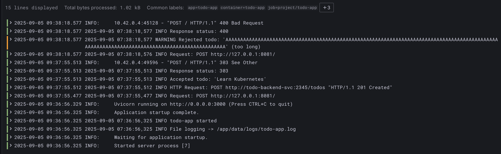

# Chapter 3

## Exercise: 2.10. The project, step 13

Deploy new version of the todo app

```bash
➜ k apply -f todo-app/manifests/deployment.yaml -n project
deployment.apps/todo-app-deployment configured
```

test todo app

```bash
➜ curl -X POST -F "todo=Learn Kubernetes" http://127.0.0.1:8081/
➜ curl -X POST -F "todo=$(printf '%.0sA' {1..141})" http://127.0.0.1:8081/
{"detail":"Todo text exceeds 140 characters"}%
```

Verify the error message in the loki logs.

